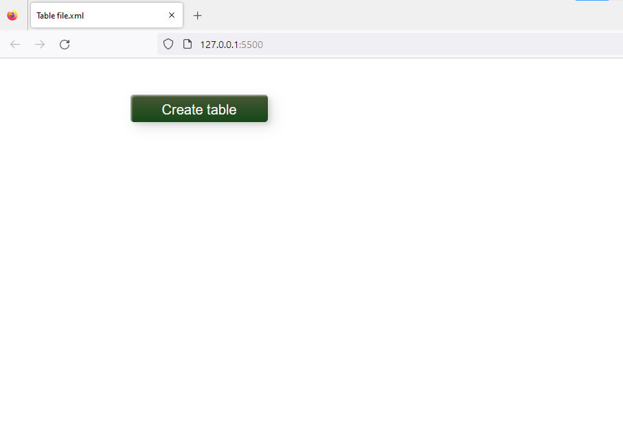
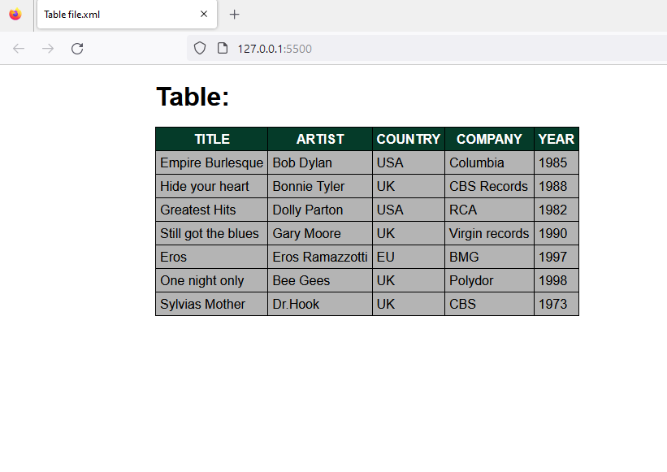
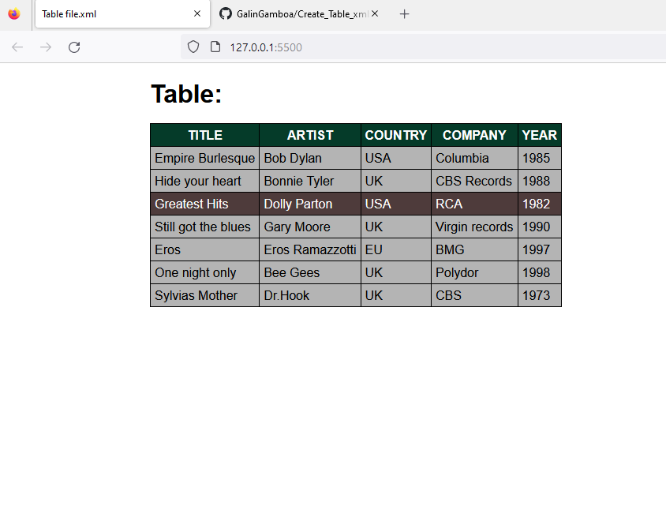

# ***Create Table with XMLHttpRequest***
[TOC]

## ***Introduction***
This is a practice where when clicking on the button (Create Table):
- A table is created from the data inside an .xml file.
- The lines of the table changed color when passing the mouse.

## ***Resources used:***
- Visual Studio Code (Editor)
- https://www.w3schools.com
- https://developer.mozilla.org

## ***Languages used:***
- Html
- JavaScript
- Css

## ***Directory***
		/images/
			img01.png
			img02.png
			img03.png
		/.gitignore
		/catalog.xml
		/index.html
		/main.js
		/style.css+
		/README.md

   
## ***Screenshots***

 

## ***Notes:***